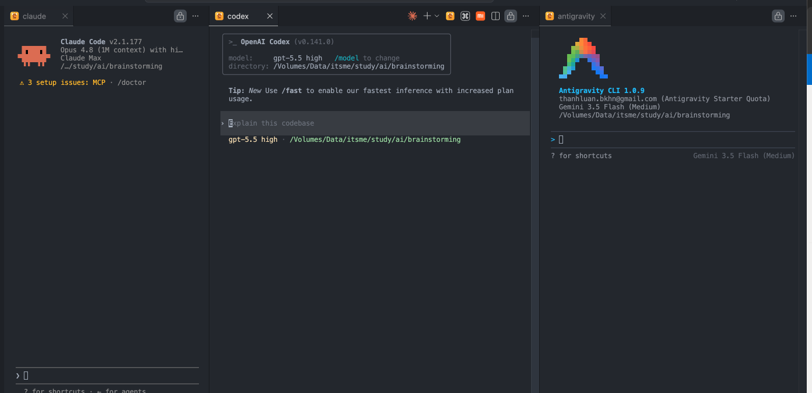
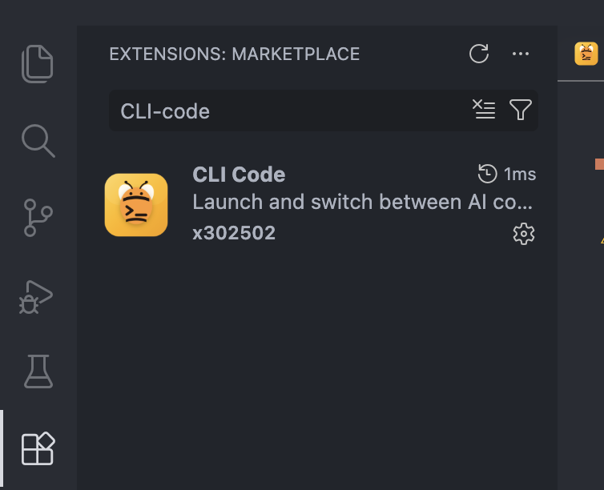
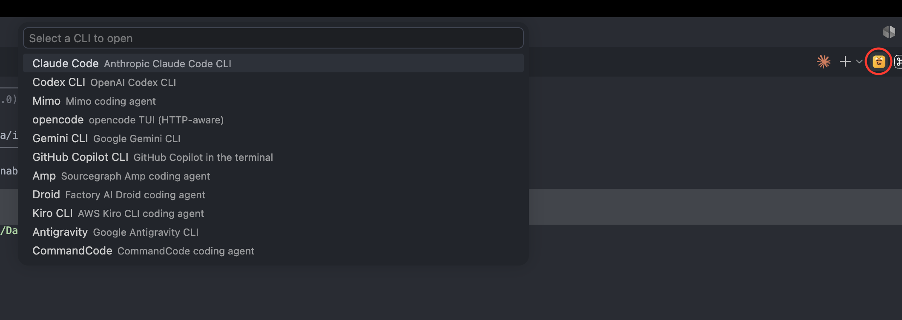
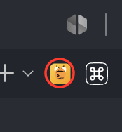

# CLI Code

[English](README.md) · **Tiếng Việt** · [中文](README.zh.md) · [日本語](README.ja.md)

> Mở trợ lý lập trình AI yêu thích của bạn trong terminal ngay cạnh code — và gửi thẳng file bạn đang xem vào đó, chỉ với một phím tắt.



## Nó làm gì?

Nhiều công cụ lập trình AI chạy trên terminal: **Claude Code, Codex, Gemini, opencode**, và nhiều hơn nữa. Nếu bạn dùng nhiều hơn một cái, việc chuyển qua lại khá mất công.

**CLI Code** đưa tất cả vào trong tầm một phím tắt:

- Nhấn một phím → chọn trợ lý → nó mở trong terminal **bên cạnh editor**.
- Nhấn một phím khác → **file bạn đang xem** (và những dòng bạn bôi đen) được đưa vào prompt của trợ lý. Khỏi copy-paste.

## Bắt đầu

### 1. Cài đặt

Mở tab **Extensions** trong VS Code (`Cmd/Ctrl + Shift + X`), tìm **CLI Code**, và bấm **Install**.



### 2. Cài các trợ lý bạn muốn dùng

CLI Code chỉ _khởi chạy_ trợ lý — nó không cài chúng. Hãy chắc rằng các trợ lý bạn muốn đã được cài và chạy được từ terminal. Mặc định nó biết các trợ lý sau:

| Trợ lý             | Lệnh terminal |
| ------------------ | ------------- |
| Claude Code        | `claude`      |
| Codex CLI          | `codex`       |
| Mimo               | `mimo`        |
| opencode           | `opencode`    |
| Gemini CLI         | `gemini`      |
| GitHub Copilot CLI | `copilot`     |
| Amp                | `amp`         |
| Droid              | `droid`       |
| Kiro CLI           | `kiro-cli`    |
| Antigravity        | `agy`         |
| CommandCode        | `commandcode` |

> 💡 Mẹo: nếu một lệnh chạy được khi bạn gõ trong terminal thường, thì nó cũng chạy được ở đây.

## Cách sử dụng

### Mở một trợ lý

Nhấn **`Cmd + Esc`** (macOS) hoặc **`Ctrl + Esc`** (Windows / Linux).

Một menu hiện ra liệt kê tất cả trợ lý. Chọn một cái — nó mở trong terminal bên cạnh và bắt đầu chạy. Nếu trợ lý đó đang mở rồi, phím tắt chỉ nhảy về terminal đó.



> Muốn một phiên hoàn toàn mới thay vì dùng lại cái đang mở? Dùng **`Cmd/Ctrl + Shift + Esc`**.

Bạn cũng có thể mở từ thanh công cụ của editor — tìm icon CLI Code (đã khoanh tròn):



### Gửi file bạn đang làm việc

1. Bấm vào một file (tùy chọn **bôi đen vài dòng**).
2. Bấm vào terminal của trợ lý để focus.
3. Nhấn **`Cmd + Alt + K`** (macOS) hoặc **`Ctrl + Alt + K`** (Windows / Linux).

CLI Code chèn một tham chiếu tới file của bạn vào prompt:

| Bạn làm gì         | Nó chèn vào          |
| ------------------ | -------------------- |
| Chỉ mở một file    | `@src/app.ts`        |
| Bôi đen một dòng   | `@src/app.ts#L10`    |
| Bôi đen nhiều dòng | `@src/app.ts#L10-20` |

Giờ chỉ cần gõ câu hỏi — trợ lý đã biết bạn đang nói về file (và dòng) nào.

## Phím tắt

| Thao tác                     | macOS               | Windows / Linux      |
| ---------------------------- | ------------------- | -------------------- |
| Mở / focus một trợ lý        | `Cmd + Esc`         | `Ctrl + Esc`         |
| Mở trợ lý trong terminal mới | `Cmd + Shift + Esc` | `Ctrl + Shift + Esc` |
| Gửi file hiện tại vào trợ lý | `Cmd + Alt + K`     | `Ctrl + Alt + K`     |

Cả ba lệnh cũng có trong Command Palette (`Cmd/Ctrl + Shift + P`): **Open CLI**, **Open CLI in new tab**, và **CLI: Insert At-Mentioned**.

## Câu hỏi thường gặp

**Menu mở ra nhưng terminal báo "command not found".**
Trợ lý đó chưa được cài hoặc không có trong `PATH`. Mở terminal thường và kiểm tra lệnh (vd `claude`) có chạy không. Nếu không, hãy cài công cụ đó trước.

**Trợ lý của tôi không có trong danh sách.**
Bạn có thể thêm bất kỳ trợ lý nào chạy trên terminal — xem [Thêm trợ lý của riêng bạn](#thêm-trợ-lý-của-riêng-bạn) bên dưới.

**Nhấn `Cmd + Alt + K` mà không có gì xảy ra.**
Hãy chắc rằng (1) có một file đang mở trong editor, và (2) terminal của trợ lý đang được focus. Tham chiếu file sẽ đi vào terminal CLI nào đang active.

**Phím tắt bị trùng với thứ khác.**
Đổi lại trong VS Code: **Preferences → Keyboard Shortcuts**, tìm "CLI", và đặt phím riêng của bạn.

## Thêm trợ lý của riêng bạn

CLI Code chỉ là một danh sách lệnh, nên bạn có thể thêm bất kỳ CLI nào. Clone repo, mở `src/lib/config.ts`, và thêm một mục:

```ts
{
  id: "my-agent",        // tên duy nhất
  label: "My Agent",     // hiển thị trong menu
  command: "my-agent",   // lệnh terminal cần chạy
  hasHttpApi: false,
}
```

Sau đó build lại và cài lại extension. Thứ tự danh sách chính là thứ tự trong menu.

## Dành cho lập trình viên

Xây dựng với [Bun](https://bun.sh).

```bash
bun install      # cài dependencies
bun run compile  # type-check + lint + build
bun test         # chạy unit test
bun run vsix     # đóng gói .vsix
```

Nhấn `F5` trong VS Code để mở Extension Development Host.

## Giấy phép

[MIT](LICENSE) © 2026 Thanh Luan
