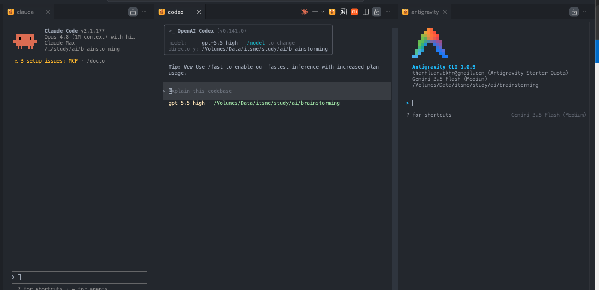
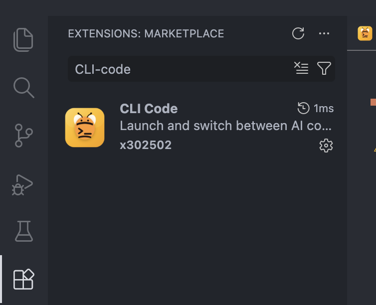
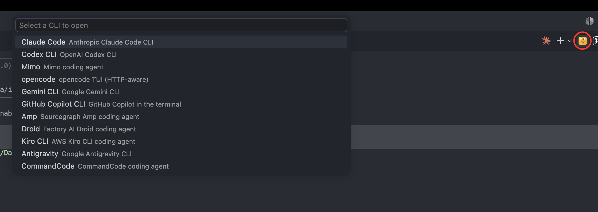
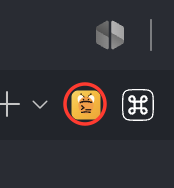

# CLI Code

[English](README.md) · [Tiếng Việt](README.vi.md) · **中文** · [日本語](README.ja.md)

> 在代码旁边的终端中打开你喜爱的 AI 编程助手，并用一个快捷键把你正在查看的文件直接送进去。



## 它能做什么？

许多 AI 编程工具运行在终端里：**Claude Code、Codex、Antigravity、opencode** 等等。如果你同时使用不止一个，来回切换会很麻烦。

**CLI Code** 让它们全都触手可及，只需一个快捷键：

- 按一个键 → 选择一个助手 → 它在**编辑器旁边**的终端中打开。
- 每个助手打开时会在终端标签上显示其**专属图标**（图标取自 [Orca](https://github.com/stablyai/orca)）。
- 按另一个键 → 把**你正在查看的文件**（以及你选中的行）送入助手的提示词。无需复制粘贴。

## 快速开始

### 1. 安装

在 VS Code 中打开**扩展**视图（`Cmd/Ctrl + Shift + X`），搜索 **CLI Code**，点击 **Install**。



### 2. 安装你想用的助手

CLI Code 只负责**启动**助手 —— 它不会安装它们。请确保你想用的助手已安装并能从终端运行。开箱即支持以下助手：

| 助手                                                                                               | 终端命令                |
| ------------------------------------------------------------------------------------------------ | ------------------- |
| [Claude Code](https://code.claude.com/docs/en/setup)                                             | `claude`            |
| [Claude Agent Teams](https://code.claude.com/docs/en/agent-teams)                                | `claude`              |
| [Codex CLI](https://developers.openai.com/codex/cli)                                             | `codex`             |
| [Grok](https://x.ai/cli)                                                                         | `grok`              |
| [GitHub Copilot CLI](https://docs.github.com/en/copilot/concepts/agents/about-copilot-cli)       | `copilot`           |
| [opencode](https://opencode.ai)                                                                  | `opencode`          |
| [MiMo Code](https://github.com/XiaomiMiMo/MiMo-Code)                                             | `mimo`              |
| [Pi](https://pi.dev)                                                                             | `pi`                |
| [OMP](https://omp.sh)                                                                            | `omp`               |
| [Antigravity](https://antigravity.google)                                                        | `agy`               |
| [Amp](https://ampcode.com)                                                                       | `amp`               |
| [Kilocode](https://kilo.ai)                                                                      | `kilo`              |
| [Cline](https://cline.bot)                                                                       | `cline`             |
| [Command Code](https://github.com/just-every/code)                                               | `command-code`      |
| [Droid](https://docs.factory.ai/cli/getting-started/quickstart)                                  | `droid`             |
| [OpenClaude](https://openclaude.gitlawb.com/)                                                    | `openclaude`        |
| [Ante](https://github.com/AntigmaLabs/ante-preview)                                              | `ante`              |
| [Trae](https://docs.trae.cn/cli_get-started-with-trae-cli)                                       | `traecli`           |
| [Prime Agent](https://github.com/PrimeIntellect-ai/prime-agent)                                  | `prime-agent`       |
| [Aider](https://aider.chat/docs/)                                                                | `aider`             |
| [Goose](https://block.github.io/goose/docs/quickstart/)                                          | `goose`             |
| [Kiro](https://kiro.dev)                                                                         | `kiro-cli`          |
| [Charm / Crush](https://github.com/charmbracelet/crush)                                          | `crush`             |
| [Auggie](https://docs.augmentcode.com/cli/overview)                                              | `auggie`            |
| [Autohand Code](https://github.com/autohandai/code-cli)                                          | `autohand`          |
| [Codebuff](https://www.codebuff.com/docs/help/quick-start)                                       | `codebuff`          |
| [Continue](https://docs.continue.dev/guides/cli)                                                 | `cn`                |
| [Cursor](https://cursor.com/cli)                                                                 | `cursor-agent`      |
| [Kimi](https://www.kimi.com/code/docs/en/kimi-code-cli/getting-started.html)                     | `kimi`              |
| [Mistral Vibe](https://github.com/mistralai/mistral-vibe)                                        | `vibe`              |
| [Qwen Code](https://github.com/QwenLM/qwen-code)                                                 | `qwen`              |
| [Rovo Dev](https://support.atlassian.com/rovo/docs/install-and-run-rovo-dev-cli-on-your-device/) | `rovo`              |
| [Hermes](https://hermes-agent.nousresearch.com/docs/)                                            | `hermes`            |
| [Devin](https://devin.ai/cli)                                                                    | `devin`             |
| [OpenClaw](https://github.com/openclaw/openclaw)                                                 | `openclaw`          |

> ⚠️ **先安装*并*登录。** 大多数助手在运行前需要先完成身份验证 —— `claude`
> （登录 Anthropic 账号）、`codex`（OpenAI 登录 / API key）等等。请在普通终端中先运行每个工具一次，完成其登录流程，并确认它能启动。
>
> 💡 提示：如果某个命令在普通终端里能运行，那它在这里也能运行。

### 🚨 助手启动时已禁用授权确认

每个 CLI 都会带上各自的绕过权限参数启动（`claude --dangerously-skip-permissions`、
`codex --dangerously-bypass-approvals-and-sandbox` 等），因此助手执行命令和修改文件时
**不会先征求你的同意**。这样很快，但也意味着不受信任的代码仓库可能诱导助手执行破坏性或
泄露数据的操作。请只在你信任的代码上使用 CLI Code，或者自己在普通终端中启动这些助手。

## 如何使用

### 打开一个助手

按 **`Cmd + Esc`**（macOS）或 **`Ctrl + Esc`**（Windows / Linux）。

弹出的菜单会列出所有助手。选择其一 —— 它会在旁边的终端中打开并开始运行。如果该助手已经打开，快捷键只会跳回到它。



> 想要一个全新会话而不是复用已打开的？使用 **`Cmd/Ctrl + Shift + Esc`**。

你也可以从编辑器工具栏打开 —— 找到 CLI Code 图标（已圈出）：



### 发送你正在处理的文件

1. 点击进入某个文件（可选地**选中几行**）。
2. 点击助手的终端使其获得焦点。
3. 按 **`Cmd + Alt + K`**（macOS）或 **`Ctrl + Alt + K`**（Windows / Linux）。

CLI Code 会把对你文件的引用插入到提示词中：

| 你做了什么     | 它插入               |
| -------------- | -------------------- |
| 刚打开一个文件 | `@src/app.ts`        |
| 选中了一行     | `@src/app.ts#L10`    |
| 选中了多行     | `@src/app.ts#L10-20` |

现在只需输入你的问题 —— 助手已经知道你指的是哪个文件（和哪些行）。

## 专属终端（0.2.0）

从 0.2.0 起，CLI Code 不再在普通的 VS Code 集成终端中打开助手 —— 每个助手都在**扩展专属的终端**中打开：一个连接到后台 PTY 守护进程的 webview 面板。这带来了：

- 每个助手的终端标签都有**彩色图标**。
- **标签标题自动更新**，根据你刚输入的提示词变化（无需手动改名）。
- 标签标题上直接显示**助手状态** —— 运行中、等待你、或已完成。
- 会话**在 Reload Window 后依然存活**：重新加载窗口后，终端会自动重新连接到正在运行的 CLI 会话，不会丢失任何内容。

### 限制

- **关闭标签＝结束该 CLI。** VS Code 不允许扩展在关闭标签前"询问确认"，所以关闭标签会立即终止其中的 CLI 进程 —— 没有警告。
- **退出 VS Code＝结束所有会话。** CLI Code 下运行的所有 CLI 都会随之停止。
- **Claude 状态钩子仅支持 POSIX**（macOS、Linux） —— Windows 无法安装该钩子。

### Claude Code 状态钩子

CLI Code 可以在 Claude Code 中安装一个小钩子，让标签显示准确的状态（运行中 / 等待 / 完成），而不是靠标题猜测。这是一个**可选启用**的功能：

- 你在 CLI Code 中第一次打开 Claude Code 时，扩展会询问是否安装该钩子（由 `cliCode.claudeStatusHooks` 设置控制）。不作答直接关掉提示，在本窗口中视为"off"——之后可用命令面板中的 **"CLI Code: Cài hook trạng thái Claude"**（安装 Claude 状态钩子）安装。
- 如果同意，它会追加写入 `~/.claude/settings.json`。首次写入前，原文件会备份为 `~/.claude/settings.json.cli-code.bak`；你已有的钩子会被保留。
- 钩子从下一次启动 Claude Code 时生效——已在运行的会话仍靠标题猜测状态。
- 随时可通过命令面板中的 **"CLI Code: Gỡ hook trạng thái Claude"**（卸载 Claude 状态钩子）移除。
- 已知限制：钩子命令由 shell `eval` 执行（`eval "$CLI_CODE_HOOK"`），VS Code 安装路径中含有 `"` 或 `$` 时钩子会失效。
- 为 `UserPromptSubmit`、`Stop`、`Notification`、`PermissionRequest` 这 4 个事件各自添加的条目内容：

  ```json
  {
    "type": "command",
    "command": "[ -n \"$CLI_CODE_HOOK\" ] && eval \"$CLI_CODE_HOOK\" || true"
  }
  ```

  当 Claude Code 在 CLI Code 之外运行时，这条命令不会产生任何效果（因为 `CLI_CODE_HOOK` 变量不存在）。

### 设置项

| 设置项                       | 类型                        | 默认值   | 说明                                                                          |
| ------------------------------ | ---------------------------- | -------- | -------------------------------------------------------------------------------- |
| `cliCode.claudeStatusHooks`    | `"ask" \| "on" \| "off"`     | `"ask"`  | 在 `~/.claude/settings.json` 中安装状态钩子，让 Claude 标签显示运行中/等待/完成。 |
| `cliCode.notifications`        | `boolean`                    | `true`   | 当隐藏标签中的助手完成工作时发出通知。                                          |
| `cliCode.quickCommands`        | 对象数组                     | `[]`     | 可复用的命令或提示词。设置在 User settings = 全局，Workspace settings = 项目。   |

`cliCode.quickCommands` 示例：

```json
"cliCode.quickCommands": [
  { "label": "运行测试", "text": "npm test" },
  { "label": "总结 PR", "text": "总结这个 PR 中的改动", "submit": true }
]
```

### 路径链接

CLI 输出的路径（`src/x.ts:12:3`、`./dir`、`~/notes.md`、`README`、`file://…`）仅在磁盘上存在时才变成链接。`Cmd/Ctrl + 点击` 在编辑器中打开文件（Markdown 为预览，HTML 为浏览器），**文件夹**在工作区内时定位到 VS Code 资源管理器，否则在 Finder / 资源管理器中打开；`Shift + Cmd/Ctrl + 点击` 用默认应用打开。普通点击会选中整个链接，随后 `Cmd/Ctrl + C` 即可完整复制。

### 终端右键菜单

**Khởi động lại phiên**（重启）会把标签带回*同一个会话*：Claude Code 使用其钩子上报的会话 ID；Codex、Grok、Pi、OMP、Command Code、Droid、Prime Agent、Copilot、Cline、Kimi、Cursor、Amp、opencode、MiMo、Kilo、goose 使用各自会话存储中该目录自标签打开以来的最新会话；其余 CLI 使用 `--continue` 形式。只有在一无所知时才会新开会话。

右键作用于指针下的内容或选区：**Sao chép**（复制，有选区时）、**Dán**（粘贴）、**Chọn tất cả**（全选）、指向 URL 时 **Mở liên kết**（打开链接）／指向文件时 **Mở tệp**（打开文件）、**Mở bằng app mặc định**（用默认应用打开）、**Chèn @đường-dẫn vào CLI**（把 @路径插入 CLI）／指向文件夹时 **Mở thư mục**（打开文件夹）、**Sao chép liên kết / đường dẫn**（复制链接/路径）、**Tìm vùng đã bôi**（查找选区）、**Tìm trong terminal**（在终端中查找）。标签级操作位于终端顶部的安静工具条（同色背景，图标靠右）：**Phiên mới**（新会话 — 先选择 CLI，在当前标签目录打开）、**Mở lại phiên cũ**（历史）、**Tìm**（查找），以及 **…** 中的 **Đổi tên tab**（重命名标签，`F2`）、**Khởi động lại phiên**（重启会话）、**Sao chép ngữ cảnh**（复制上下文）、**Lệnh nhanh**（快捷命令）。工具条左侧仅在代理需要你确认时显示文字。悬停链接会提示 `Cmd/Ctrl + 点击` 将打开什么及解析后的路径。

### 命令面板命令

0.2.0 的命令以越南语标题注册（括号内为中文释义）：

`CLI Code:` **Mở lại phiên cũ**（恢复历史会话）、**Lệnh nhanh**（快捷命令）、**Lưu thành lệnh nhanh**（保存为快捷命令）、**Đổi tên tab**（重命名标签）、**Khởi động lại phiên**（重启会话）、**Phóng to chữ**（放大字体）、**Thu nhỏ chữ**（缩小字体）、**Cỡ chữ mặc định**（重置字体大小）、**Tìm trong terminal**（在终端中查找）、**Sao chép ngữ cảnh**（复制上下文）、**Dán**（粘贴）、**Sao chép**（复制）、**Cài hook trạng thái Claude**（安装 Claude 状态钩子）、**Gỡ hook trạng thái Claude**（卸载 Claude 状态钩子）。

## 快捷键

| 操作                  | macOS                | Windows / Linux        |
| ----------------------- | --------------------- | ------------------------ |
| 打开 / 聚焦一个助手     | `Cmd + Esc`           | `Ctrl + Esc`             |
| 在新终端中打开助手      | `Cmd + Shift + Esc`   | `Ctrl + Shift + Esc`     |
| 把当前文件发送给它      | `Cmd + Alt + K`       | `Ctrl + Alt + K`         |
| 在提示词中换行          | `Shift + Enter`       | `Shift + Enter`         |
| 在终端中查找            | `Cmd + F`             | `Ctrl + F` \*           |
| 放大字体                | `Cmd + =`             | `Ctrl + =`               |
| 缩小字体                | `Cmd + -`             | `Ctrl + -`               |
| 重置字体大小            | `Cmd + 0`             | `Ctrl + 0`               |

\* 在 Windows / Linux 上，聚焦的终端会吃掉 `Ctrl + F`（xterm 把它作为 `^F` 发给 CLI）。请改用命令面板中的 **"CLI Code: Tìm trong terminal"** 或右键菜单的 **Tìm trong terminal**。

## 常见问题

**助手打开了，但要求我登录。**
这是正常的 —— CLI Code 只负责启动工具，不处理身份验证。在任意终端中完成该助手自己的登录流程一次，之后它会记住你。

**按 `Cmd + Alt + K` 没有反应。**
请确保（1）编辑器中有打开的文件，并且（2）助手的终端处于焦点状态。文件引用会进入当前活动的 CLI 终端。

**快捷键与其他功能冲突。**
在 VS Code 中重新绑定：**Preferences → Keyboard Shortcuts**，搜索 "CLI"，设置你自己的按键。

## 许可证

[MIT](LICENSE) © 2026 Thanh Luan
